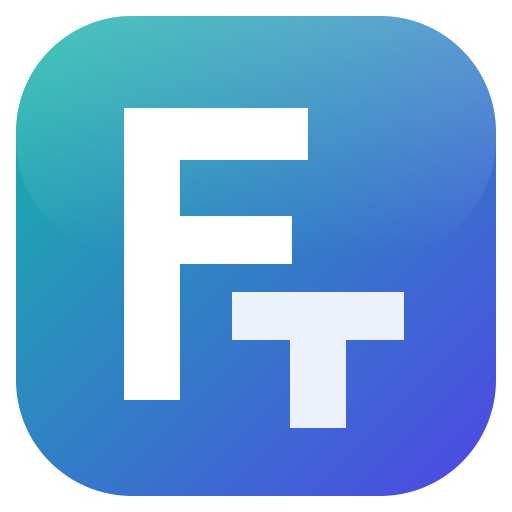

<p align="center">
  
</p>

<h1 align="center">FreedomTex</h1>

<p align="center"><b>A free, offline LaTeX editor for Windows.</b><br>
Write theses, papers, reports and slides on your own computer, with no subscription and no internet required.</p>

<p align="center">
  Developed by <b>Shahid Zafar</b>, PhD Candidate, Multimedia University, Malaysia ·
  <a href="https://freedomsoft.uk">freedomsoft.uk</a><br>
  Dedicated to the students of <b>Multimedia University (MMU), Malaysia</b>, to give them relief from paying for LaTeX subscriptions.
</p>

---

## Features

**Editing**
- Code editor with LaTeX and BibTeX syntax highlighting, code folding, bracket matching and multiple cursors
- Visual editor mode: headings, bold and italic, lists, maths (rendered with KaTeX) and images shown in place
- Smart autocomplete for commands, environments, `\ref` labels, `\cite` keys, packages, files and images
- Live maths preview, code check for unclosed environments and braces, spell check with suggestions
- Formatting toolbar, symbol palette, figure and table inserters
- Standard, Vim and Emacs key bindings

**Compiling and PDF**
- pdfLaTeX, XeLaTeX and LuaLaTeX, with BibTeX, Biber, makeindex, nomenclature and glossaries handled automatically
- Auto compile, draft mode, stop on first error, recompile from scratch
- Built-in PDF viewer with zoom, page navigation, clickable links and dark mode
- SyncTeX: jump from code to PDF and double-click the PDF to jump back to the code
- Logs and errors panel with plain-language hints and one-click navigation to the line

**Packages**
- MiKTeX is bundled in the installer and set up on first launch, with no internet needed
- When a document or template needs a package you do not have, FreedomTex names it, asks, installs it and recompiles

**Projects**
- Project dashboard with search, tags, archive and trash
- 13 templates: postgraduate thesis, IEEE and Elsevier papers, two-column article, slides, poster, CV, letter, assignment, proposal, book and more
- Upload ZIP, open any folder, download source as ZIP, download PDF
- File tree with drag and drop, upload from Explorer, and a main-document selector
- Project-wide search and replace, file outline, word count

**Writing tools**
- Version history with automatic snapshots, labelled versions, side-by-side changes and restore
- Review comments with replies and resolve
- **Zotero integration**: import references from the Zotero desktop app (offline, with Better BibTeX keys) or a zotero.org library, including collections and sub-collections, with one-click refresh
- Git integration: init, commit, push and pull

**Design**
- Modern interface with light and dark themes (or follow Windows), adjustable interface size and editor fonts

## Install

Download the latest version from the [Releases page](https://github.com/shahidzafarsg/freedomtex/releases).

### Windows

1. Download the installer for your PC and run it. FreedomTex installs for your Windows account only, so administrator rights are not needed.
   - `FreedomTex-Setup-<version>.exe` for most PCs (Intel or AMD processor).
   - `FreedomTex-Setup-<version>-arm64.exe` for Windows on ARM (Snapdragon processors, for example Copilot+ PCs and Surface Pro X).

   Not sure? Open **Settings > System > About** and check **System type**: "x64-based processor" or "ARM-based processor".
2. On first launch, choose **Install MiKTeX (included)**. After that, everything works offline.

> Windows may show a SmartScreen notice because the installer is not code-signed. Choose **More info**, then **Run anyway**.

**Requirements:** Windows 10 or 11 (64-bit), about 1 GB of free disk space. Windows on ARM needs Windows 11: MiKTeX has no ARM version yet, so it runs through the x64 emulation built into Windows 11.

### macOS

1. Download the `.dmg` for your Mac: `mac-arm64` for Apple Silicon (M1 and later), `mac-x64` for Intel Macs.
2. Open it and drag **FreedomTex** into **Applications**.
3. The first time, macOS blocks apps from unidentified developers. Open **System Settings > Privacy & Security**, scroll down and choose **Open Anyway** next to the FreedomTex message. (On older macOS, right-click the app and choose **Open**.)
4. On first launch, choose **Download and install BasicTeX**, or point FreedomTex to an existing MacTeX installation. Missing packages are installed when a document needs them; macOS asks for your password.

> If macOS says the app "is damaged", run `xattr -cr /Applications/FreedomTex.app` in Terminal once. This clears the download quarantine flag on unsigned apps.

**Requirements:** macOS 12 or later.

## Using Zotero

1. Open the Zotero 7 desktop app.
2. In Zotero, open **Edit > Settings > Advanced** and tick **Allow other applications on this computer to communicate with Zotero**.
3. In FreedomTex, choose **Tools > Import References from Zotero**, pick a collection and a `.bib` file name, then **Import**.
4. Add `\bibliography{references}` (BibTeX) or `\addbibresource{references.bib}` (biblatex) to your document if it is not there yet.

Installing the [Better BibTeX](https://retorque.re/zotero-better-bibtex/) plugin for Zotero is recommended for stable citation keys. You can also connect a zotero.org library with your user ID and a read-only API key.

## Build from source

Requires Node.js 20 or later and Windows.

```bash
npm install
node node_modules/electron/install.js
npm run dev
```

To build the installer (downloads and verifies the MiKTeX basic installer, about 142 MB):

```bash
npm run dist
```

The installer is written to `release/`. Use `npm run dist:arm64` for the Windows on ARM installer.

Useful scripts:

| Command | What it does |
| --- | --- |
| `npm run dev` | Run the app with hot reload |
| `npm run smoke` | End-to-end UI test with screenshots in `scripts/.smoke` |
| `npm run test:templates` | Create and compile every template |
| `npm run icons` | Regenerate the app icon and sample figure |

## Project layout

```
electron/          Main process: projects, files, compiler, MiKTeX, SyncTeX, history, Zotero, Git
src/               Interface (React): editor, PDF viewer, dialogs, styles
src/editor/        CodeMirror setup, LaTeX mode, autocomplete, visual mode, comments
templates/         Project templates bundled with the app
scripts/           Development, build and test scripts
build/             Icons used by the installer
```

## License

FreedomTex is open source under the [MIT License](LICENSE). Copyright © 2026 Shahid Zafar.
Third-party components are listed in [THIRD_PARTY_NOTICES.md](THIRD_PARTY_NOTICES.md).
